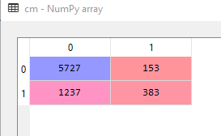
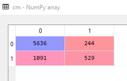
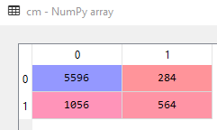
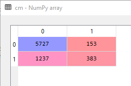
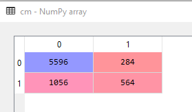
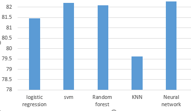

# Credit_eligibility

## Classification of credit holders using traditional machine learning algorithms

Credit Score is a numerical expression which analyze the creditworthiness of any individual. Credit scoring becomes important as it help the bank workers to estimate whether the individual qualifies for a loan or not.  The bank workers receive a large number of credit application on daily basis it is impossible to analyze this huge amount of data in terms of both economic as well as manpower so we apply various data mining techniques to check the creditability of the applicant. 

This project aimed at the case of customer’s default payments in Taiwan and compares the predictive accuracy of probability of default among six data mining methods. From the perspective of risk management, the result of predictive accuracy of the estimated probability of default will be more valuable than the binary result of classification - credible or not credible clients. Because the real probability of default is unknown, this study presented the novel Sorting Smoothing Method to estimate the real probability of default. With the real probability of default as the response variable (Y), and the predictive probability of default as the independent variable (X), the simple linear regression result (Y = A + BX) shows that the forecasting model produced by artificial neural network has the highest coefficient of determination; its regression intercept (A) is close to zero, and regression coefficient (B) to one. Therefore, among the six data mining techniques, artificial neural network is the only one that can accurately estimate the real probability of default.

# IMPLEMENTATION AND RESULTS 

The results we obtained by applying different classification models are in the form of Confusion Matrix.

1. Logistic Regression:

      

2. Support Vector Machine(SVM):

    

3. Random Forest:

    

4. Neural Network:

    

5. K-NN:

    

# ACCURAY CHART:

    

*  We conclude that almost all the algorithms are giving acuuracy around 80%.
* The best accuracy we obtained is by using Neural Network.
* So we can use Deep Learning to predict the Credit Scoring it will give us the best result.
